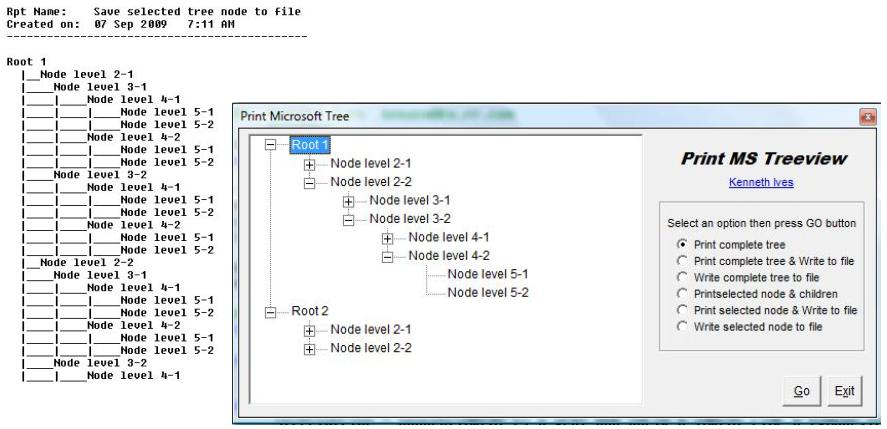



## Print Tree  11\-Sep\-2011

### Description

Example of printing a tree to either printer, file, or both. Select either the complete tree or a specific node.

=== 11-Sep-2011 Removed obsolete code, updated support modules and updated documentation. Any unused procedures or variables left behind is for future reference.
 
### More Info
 

             |
---                |---
**Submitted On**   |2011-09-10 09:19:00
**By**             |[Kenaso](https://github.com/Planet-Source-Code/PSCIndex/blob/master/ByAuthor/kenaso.md)
**Level**          |Intermediate
**User Rating**    |5.0 (10 globes from 2 users)
**Compatibility**  |VB 6\.0
**Category**       |[Custom Controls/ Forms/  Menus](https://github.com/Planet-Source-Code/PSCIndex/blob/master/ByCategory/custom-controls-forms-menus__1-4.md)
**World**          |[Visual Basic](https://github.com/Planet-Source-Code/PSCIndex/blob/master/ByWorld/visual-basic.md)
**Archive File**   |[Print\_Tree2211109102011\.zip](https://github.com/Planet-Source-Code/kenaso-print-tree-11-sep-2011__1-72437/archive/master.zip)

